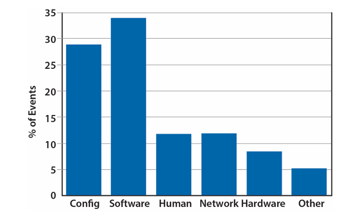

# Dealing with Failures and Repairs
## Software-based fault tolerance
- Fault-tolerated softwares:
    - Pros: We can use cheaper/less reliable hardwares to maximize cost efficency
    - Cons: Harder to implement

## Categorizing faults
- Fault Serverity ranking (decreasing in severity):
    1. Corrupted: data is corrupted, lost
    2. Unreachable: service is down, or unreachable
    3. Degraded: service is available but in degraded mode, aka service is getting slower
    4. Masked: failure occurs but is hidden by fault-tolerant soft/hard ware

- Ideally, all faults are masked and invisble outside of service provider

## Causes of Service-level Faults

- Hardware fault doesn't happen a lot because of good fault-tolerant. Fault-tolerant is easier to implement if system is static independent (like all hardwares)